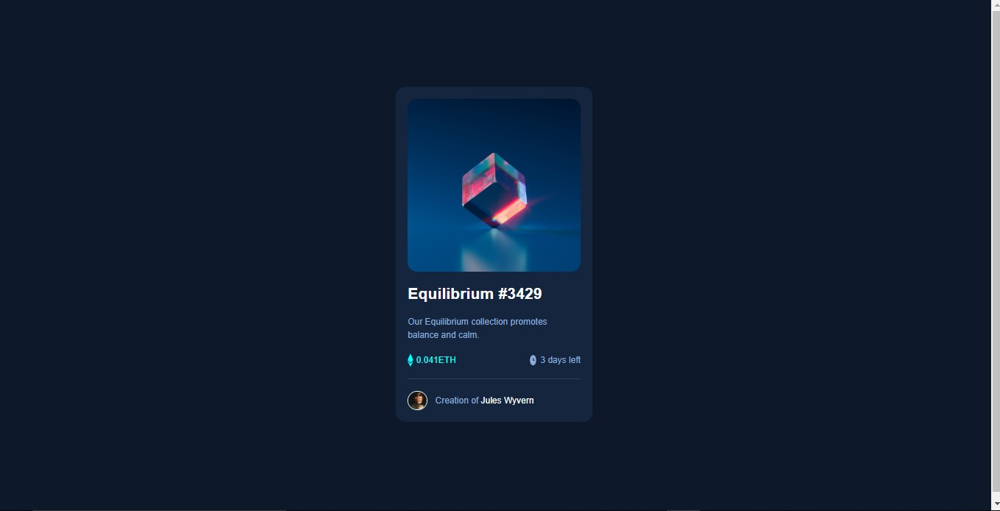
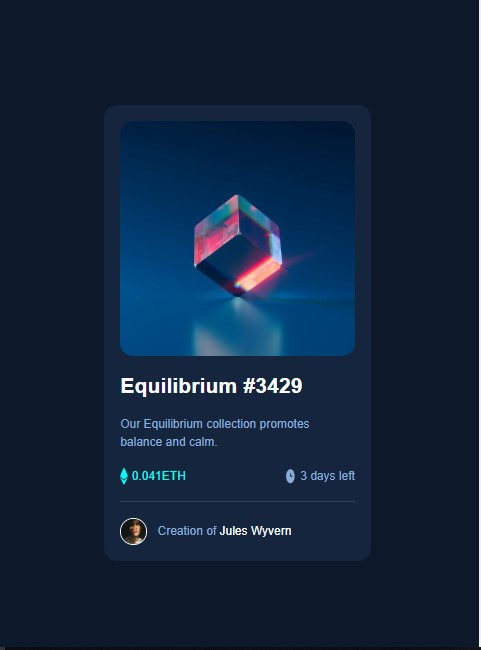

# Frontend Mentor - NFT preview card component solution

This is a solution to the [NFT preview card component challenge on Frontend Mentor](https://www.frontendmentor.io/challenges/nft-preview-card-component-SbdUL_w0U). Frontend Mentor challenges help you improve your coding skills by building realistic projects.

## Table of contents

- [Overview](#overview)
  - [The challenge](#the-challenge)
  - [Screenshot](#screenshot)
  - [Links](#links)
- [My process](#my-process)
  - [Built with](#built-with)
  - [What I learned](#what-i-learned)
  - [Useful resources](#useful-resources)
- [Author](#author)

## Overview

### The challenge

Users should be able to:

- View the optimal layout depending on their device's screen size
- See hover states for interactive elements

### Screenshot




### Links

- Solution URL: [https://github.com/Dprof-code/nft-preview-card-component-main]
- Live Site URL: [https://silver-kitten-9b2673.netlify.app/]

## My process

### Built with

- Semantic HTML5 markup
- CSS custom properties
- Flexbox
- CSS Grid

### What I learned

I learnt how to use the CSS Selectors and Combinators

```css
.nft-image-wrapper img:hover + .nft-image-wrapper-overlay {
  display: block;
}
```

### Useful resources

- [resource](https://www.w3schools.com/howto/howto_css_display_element_hover.asp/) - This helped me to understand CSS combinators.

## Author

- Website - [Olawale Adedamola](https://www.linkedin.com/in/olawale-adedamola-b9b1641a2/)
- Frontend Mentor - [@Dprof-code](https://www.frontendmentor.io/profile/Dprof-code)
- Twitter - [@pr0devs](https://www.twitter.com/pr0devs)
